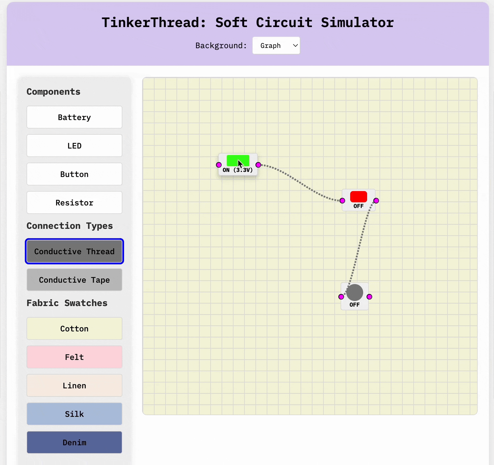
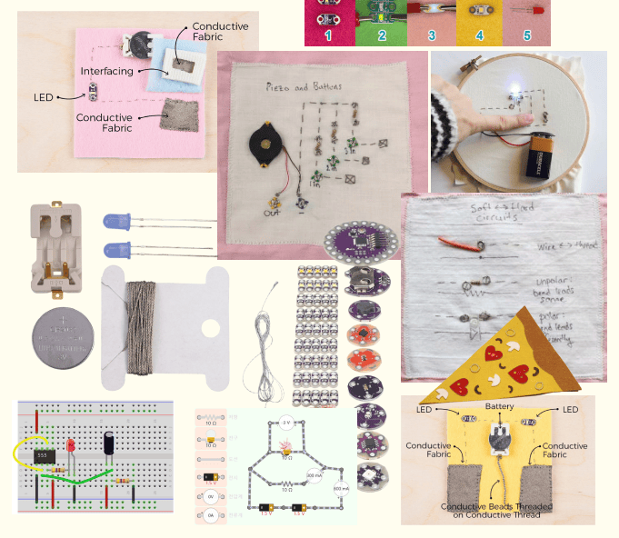

# TinkerThread: Soft Circuit Simulator ⚡️🔋🧵🌸

<b>TinkerThread</b> is an interactive web-based simulator for designing and experimenting with soft circuits. It allows users to drag and drop electronic components (like LEDs, batteries, and resistors) onto a canvas, connect them using conductive thread or tape, and simulate the behavior of the circuit. Perfect for educators, hobbyists, and anyone interested in e-textiles and soft circuits!

## ✿ Features

- Drag-and-Drop Components: Easily add components like LEDs, batteries, buttons, and resistors to the canvas.
- Connection Types: Choose between conductive thread or tape to connect components.
- Real-Time Simulation: Visualize the flow of current and see how components behave when connected.
- Customizable Background: Select from different fabric swatches and background patterns to simulate real-world e-textile projects.
- Interactive Tutorial: Learn how to use the simulator with a step-by-step tutorial.
- Export/Import Circuits: Save your designs as JSON files and load them later to continue working.

## ✿ Moodboard / Inspiration

## ✿ Live Demo

Check out the live demo of TinkerThread [here](https://tinkerthread.netlify.app/)
